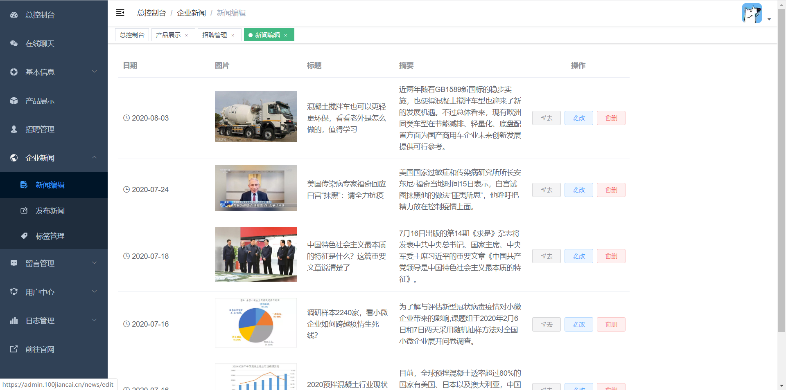

# 建材门户网站后台管理系统

## 效果预览

展示部分页面效果
  
  
  
  

  
  
  
  
  
  
  
  
  
  


## 项目地址

https://admin.100jiancai.cn

## nginx配置
请参考另100jiancai-front项目

## 未上传的密钥文件

- .env.development
- .env.production
- src/const/secret.js
  这三个文件的内容分别如下：

```properties
ENV = 'development'
# base api
VUE_APP_BASE_API = 'http://localhost:9999'
VUE_CLI_BABEL_TRANSPILE_MODULES = true
```

```properties
ENV = 'production'
# base api
VUE_APP_BASE_API  = 'https://admin.100jiancai.cn/api'
```

```js
module.exports = {
  // 存放本项目图片文件的配置，本项目用到了七牛云的三个Bucket
  // 其中cdn用于存放JS和CSS等项目内的静态文件
  // imageCdnConfig用于存放图片 分为官网图片和管理后台图片
  cdn: {
    bucket: "",
    accessKey: "",
    secretKey: "",
    cdnHost: ""
  },
  imageCdnConfig: {
    imageHostPublic: "",
    imageHostAdmin: "",
    bucketPublic: "",
    bucketAdmin: "",
    accessKey: "",
    secretKey: ""
  },
  // 存放本项目index.html的配置（需要搭建FTP服务器）
  ftpConfig: {
    host: "<主机IP>",
    user: "",
    password: "",
    port: 21
  }
};
```
